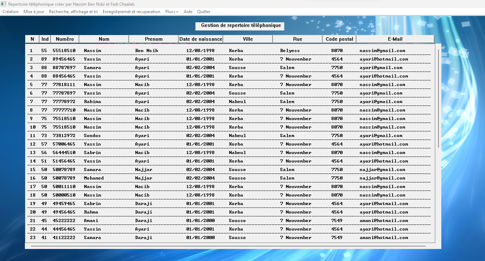
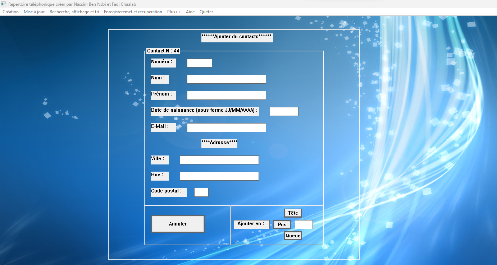

# Projet de Répertoire Téléphonique en C

Ce projet consiste en la création d'une application de gestion de répertoire téléphonique en utilisant le langage de programmation C. L'application utilise des listes chaînées comme structure de données principale pour stocker les informations de contact.

## Fonctionnalités

L'application comprend les fonctionnalités suivantes :

1. **Création du Répertoire Téléphonique :** Permet à l'utilisateur d'ajouter des contacts au répertoire. Chaque contact peut avoir un numéro de téléphone, un nom, un prénom, une adresse, une date de naissance et une adresse e-mail.

2. **Mise à Jour des Contacts :** Permet d'ajouter, de supprimer ou de modifier les informations d'un contact existant.

3. **Recherche et Affichage :** Permet de rechercher et d'afficher des contacts en fonction de différents critères tels que le numéro de téléphone, le nom, l'indicatif téléphonique, la ville, etc. Les contacts peuvent également être triés par numéro de téléphone.

4. **Enregistrement et Chargement :** Les données du répertoire peuvent être enregistrées dans un fichier et chargées à partir du fichier pour une utilisation ultérieure.

## Utilisation

1. Clonez ce dépôt sur votre machine locale.
2. Compilez le programme en utilisant un compilateur C compatible avec Windows.
3. Exécutez le programme et suivez les instructions du menu pour interagir avec le répertoire téléphonique.

Assurez-vous d'avoir installé un compilateur C et la bibliothèque Windows.h (si nécessaire) pour exécuter ce programme.

## Auteur

Ce projet a été développé par Nassim BEN NSIB.
Contact : [nassim.bennsib@gmail.com](mailto:nassim.bennsib@gmail.com)

## Remarque

Ce projet a été réalisé dans le cadre de [L'Institut Supérieur d'Informatique et des Mathématiques de Monastir](http://www.isimm.rnu.tn/public/) pour démontrer les compétences en programmation en langage C et la manipulation de structures de données telles que les listes chaînées.

---
